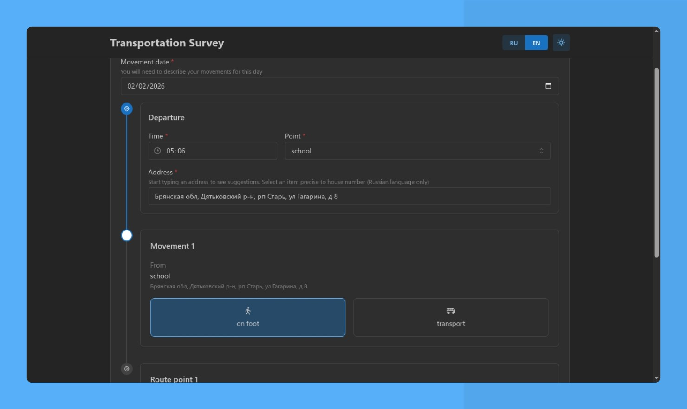

  

<h1 align="center">Geospatial web forms</h1>

  Forms built to collect geospatial related data

## Development

1. Install [mkcert](https://github.com/FiloSottile/mkcert) on your host
2. [Install Docker on your host](https://letmegooglethat.com/?q=install+docker)
3. Create `.env`. Look at the reference at [.env.example](./.env.example)
4. Use [devcontainer](./.devcontainer/devcontainer.json)

## Contribution

Look at [contributing.md](./.github/contributing.md)
