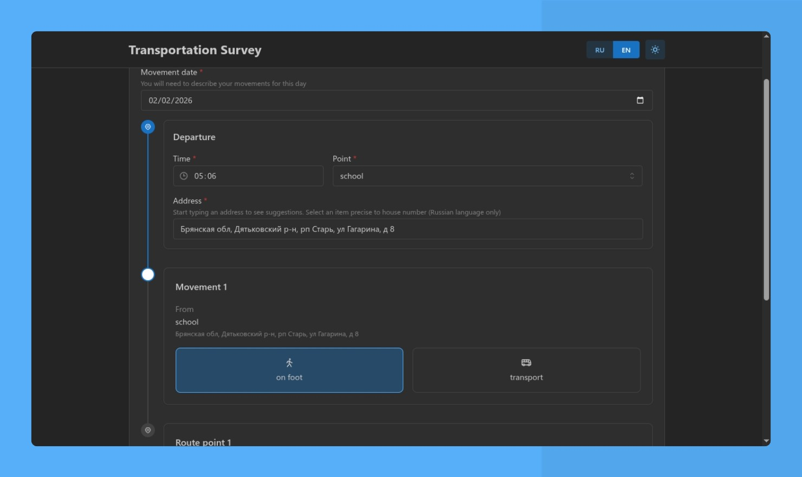

  

<h1 align="center">Geospatial web forms</h1>

  Forms built to collect geospatial related data

## Development

Use [devcontainer](./.devcontainer/devcontainer.json)

## Contribution

Look at
[contributing.md](https://github.com/B216-lab/.github/blob/main/.github/.github/CONTRIBUTING.md)
